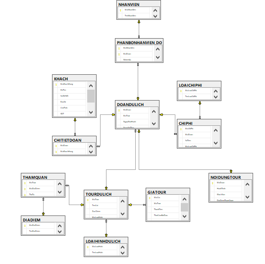

# QuanLyTour
Công ty thiết kế nhiều tour du lịch chẳng hạn như: Tour Sài Gòn – Nha Trang, Sài Gòn – Đà Lạt, Sài Gòn – Miền Tây, Sài Gòn – Tây Nguyên,…. 
 
Mỗi tour có các thông tin như: mã số tour, tên gọi tour, đặc điểm,… Mỗi tour có một số địa điểm đến tham quan và tất nhiên mỗi địa điểm cũng được khai thác bởi nhiều tour. Mỗi tour có một giá tour– giá tour này có thể được thay đổi theo thời gian hoặc theo mùa. Mỗi tour thuộc về một loại hình du lịch nào đó (chẳng hạn như: du lịch di động, du lịch kết hợp nghề nghiệp, du lịch xã hội và gia đình,…)
 
Mỗi đoàn du lịch có nhiều khách, mỗi đoàn có một mã số đoàn khách, tên gọi đoàn để phân biệt (có ý nghĩa tương đối, nếu là đoàn của một đơn vị thì có thể lấy tên của đơn vị đó làm tên của đoàn, nếu đoàn được ghép nối từ nhiều khách du lịch đơn lẻ thì có thể lấy tên gọi tour làm tên gọi của đoàn), ngày khởi hành chuyến đi, ngày kết thúc chuyến đi, chi tiết nội dung về chương trình tham quan của đoàn đó (sơ bộ nội dung hành trình mà đoàn sẽ đi, khách sạn mà đoàn sẽ nghỉ lại, những địa điểm tham quan mà đoàn sẽ đến,…).
 
Chi phí của đoàn du lịch gồm tổng chi phí cho các khách sạn, tổng chi phí cho tất cả các bữa ăn, tổng chi phí cho tất cả các phương tiện, tổng các chi phí khác để công ty có thể biết được doanh số thu của từng đoàn khách tham quan. Mỗi đoàn du lịch như vậy được phân bổ một số nhân viên đi theo đoàn – các nhân viên ở đây có thể làm các nhiệm vụ như: lái xe, hướng dẫn viên, phục vụ, thông dịch viên, tiền trạm,…
 
Các nhiệm vụ này không nhất thiết phải cố định mà có thể được bố trí phù hợp theo tình hình của từng đoàn du lịch cụ thể.
Mỗi khách hàng có mã số khách hàng, họ tên khách hàng, số chứng minh nhân dân, địa chỉ, giới tính, số điện thoại (nếu là khách nước ngoài thì cần có các thông tin liên quan khác tương ứng).
 

# Database 

  

  
